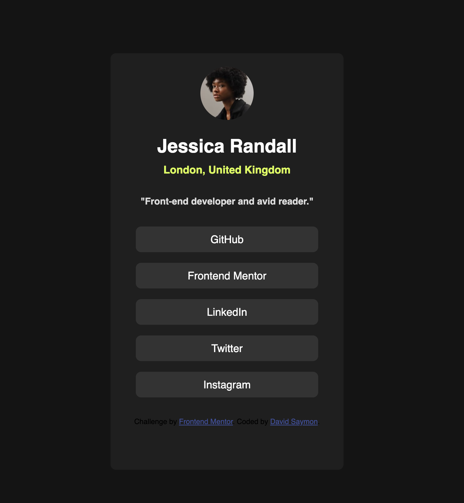

# Social Links Profile Page

Este projeto é uma solução para o desafio do Frontend Mentor de criar uma página de perfil com links sociais. A página é fictícia e apresenta o perfil de "Jessica Randall".

## Índice

## Índice

- [Social Links Profile Page](#social-links-profile-page)
  - [Índice](#índice)
  - [Índice](#índice-1)
  - [Visão Geral](#visão-geral)
    - [O Desafio](#o-desafio)
    - [Screenshot](#screenshot)
    - [Links](#links)
  - [My process](#my-process)
    - [Built with](#built-with)
  - [Meu Processo](#meu-processo)
    - [Construído com](#construído-com)
  - [Author](#author)

## Visão Geral

### O Desafio

Os usuários devem ser capazes de:

- Ver estados de hover e focus para todos os elementos interativos na página.

### Screenshot

### Links

- URL da Solução: [Adicionar URL da solução aqui](https://your-solution-url.com)
- URL do Site ao FrontEnd Mentor: [Adicionar URL do site ao vivo aqui](https://www.frontendmentor.io/challenges/social-links-profile-UG32l9m6dQ)

## My process

### Built with

- Semantic HTML5 markup
- CSS custom properties
- Flexbox
- CSS Grid
- Mobile-first workflow
- [React](https://reactjs.org/) - JS library
- [Next.js](https://nextjs.org/) - React framework
- [Styled Components](https://styled-components.com/) - For styles

## Meu Processo

### Construído com

- HTML5 semântico
- Propriedades customizadas de CSS
- Flexbox
- Sass
- Gulp
- Metodologia BEM para organização do CSS

## Author

- Github - [@davidsaymon](https://github.com/davidsaymon)
- Twitter - [@yourusername](https://www.twitter.com/davidsaymon)
